# Salah-Eddine JAOUAD

---

# CQRS et Event Sourcing

## Table des Matières
1. [Introduction](#introduction)
2. [Objectifs du Projet](#objectifs-du-projet)
3. [Architecture et Concepts](#architecture-et-concepts)
4. [Technologies Utilisées](#technologies-utilisées)
5. [Structure du Projet](#structure-du-projet)
6. [Installation et Configuration](#installation-et-configuration)
7. [Démarrage de l'Application](#démarrage-de-lapplication)
8. [Tests et Validation](#tests-et-validation)
9. [Résultats et Observations](#résultats-et-observations)
10. [Conclusion](#conclusion)

---

## Introduction

Ce rapport présente l'implémentation d'une application bancaire distribuée basée sur les patterns architecturaux **CQRS (Command Query Responsibility Segregation)** et **Event Sourcing**. Le projet utilise **Spring Boot 3.5.9** avec **Axon Framework 4.12.2** pour démontrer une architecture moderne de micro-services orientée événements.

<div align="center">
    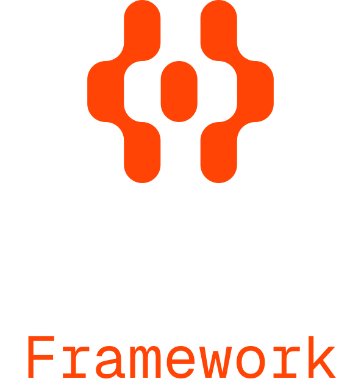
</div>

L'application simule un système de gestion de comptes bancaires permettant la création de comptes, l'activation, les opérations de crédit/débit, ainsi que l'analyse en temps réel des transactions via un service analytique dédié.

---

## Objectifs du Projet

Les principaux objectifs de ce projet sont :

1. **Implémenter une architecture CQRS complète** séparant les opérations de lecture et d'écriture
2. **Mettre en oeuvre l'Event Sourcing** pour persister l'historique complet des événements métier
3. **Développer deux micro-services communicants** via un bus d'événements asynchrone
4. **Garantir la cohérence éventuelle** entre les différentes vues de données
5. **Valider l'architecture** par des tests fonctionnels exhaustifs

---

## Architecture et Concepts

### CQRS (Command Query Responsibility Segregation)

<div align="center">
    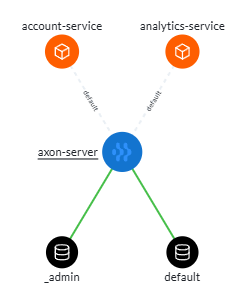
</div>

Le pattern CQRS sépare les responsabilités en deux modèles distincts :

- **Command Side (Écriture)** : Traite les commandes qui modifient l'état du système
  - Commands : `CreateAccountCommand`, `CreditAccountCommand`, `DebitAccountCommand`
  - Aggregates : `AccountAggregate` qui valide les règles métier
  - Events : `AccountCreatedEvent`, `AccountCreditedEvent`, `AccountDebitedEvent`

- **Query Side (Lecture)** : Gère les requêtes de consultation via des projections optimisées
  - Event Handlers : Écoutent les événements et mettent à jour les projections
  - Repositories : Accès direct aux vues de lecture (JPA)
  - DTOs : Objets optimisés pour les réponses REST

### Event Sourcing

Au lieu de persister uniquement l'état actuel, Event Sourcing enregistre tous les événements qui ont conduit à cet état. Chaque changement d'état génère un événement immuable stocké dans l'Event Store (Axon Server).

**Avantages** :
- Traçabilité complète des opérations
- Possibilité de reconstruire l'état à tout moment
- Audit naturel du système
- Facilite l'analyse et le debugging

### Architecture Globale

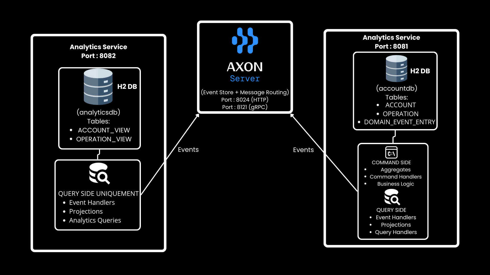

### Flux de Traitement d'une Commande


1. Client REST → POST /commands/accounts/create
2. CommandController reçoit la requête
3. CommandGateway envoie CreateAccountCommand
4. AccountAggregate traite la commande
5. AccountAggregate émet AccountCreatedEvent
6. Axon Server stocke l'événement dans l'Event Store
7. Axon Server route l'événement vers les Event Handlers
8. AccountEventHandler (Account Service) met à jour la projection
9. AnalyticsEventHandler (Analytics Service) met à jour sa vue
10. Client reçoit l'ID du compte créé

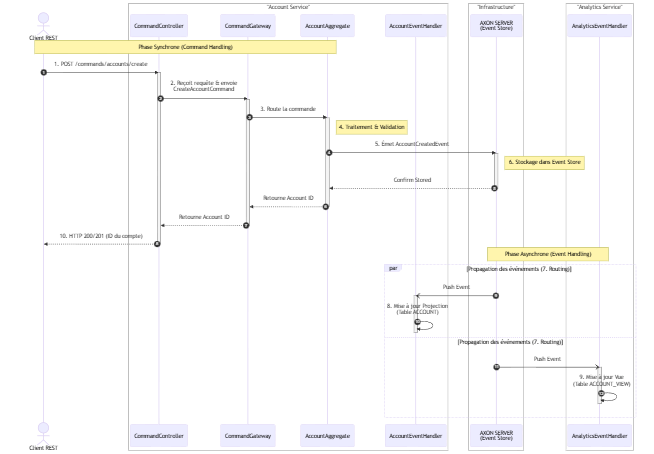

---

## Technologies Utilisées

| Technologie | Version | Rôle |
|------------|---------|------|
| Java | 21 | Langage de programmation |
| Spring Boot | 3.5.9 | Framework applicatif |
| Axon Framework | 4.12.2 | Framework CQRS/Event Sourcing |
| Axon Server | Latest | Event Store et message bus |
| Lombok | 1.18.36 | Réduction du code boilerplate |
| H2 Database | Embedded | Base de données en mémoire (développement) |
| PostgreSQL | Latest | Base de données production (Docker) |
| Maven | 3.x | Gestion des dépendances |
| Docker Compose | v2 | Orchestration des conteneurs |
| SpringDoc OpenAPI | 2.6.0 | Documentation API (Swagger) |

---

## Structure du Projet

Le projet suit une architecture multi-modules Maven

- **JDK 21** installé
- **Maven 3.x** (ou utiliser le wrapper `./mvnw`)
- **Docker** et **Docker Compose** (pour Axon Server)
- **Postman** (pour tester les APIs)

## Installation et Exécution

### 1. Architechture du projet
 :

```
cqrs-event-sourcing/
│
├── pom.xml                          # Parent POM
│
├── core-api/                        # Module partagé entre les services
│   ├── src/main/java/ma/jaouad/coreapi/
│   │   ├── commands/                # Commandes CQRS
│   │   │   ├── CreateAccountCommand.java
│   │   │   ├── CreditAccountCommand.java
│   │   │   ├── DebitAccountCommand.java
│   │   │   └── ChangeAccountStatusCommand.java
│   │   │
│   │   ├── events/                  # Événements métier
│   │   │   ├── AccountCreatedEvent.java
│   │   │   ├── AccountActivatedEvent.java
│   │   │   ├── AccountCreditedEvent.java
│   │   │   └── AccountDebitedEvent.java
│   │   │
│   │   ├── dtos/                    # DTOs pour REST
│   │   │   ├── CreateAccountRequestDTO.java
│   │   │   ├── CreditAccountRequestDTO.java
│   │   │   └── DebitAccountRequestDTO.java
│   │   │
│   │   └── enums/                   # Énumérations
│   │       ├── AccountStatus.java   # CREATED, ACTIVATED, SUSPENDED
│   │       └── OperationType.java   # CREDIT, DEBIT
│   │
│   └── pom.xml
│
├── account-service/                 # Service principal (Command + Query)
│   ├── src/main/java/ma/jaouad/accountservice/
│   │   │
│   │   ├── commands/
│   │   │   └── aggregates/
│   │   │       └── AccountAggregate.java     # Aggregate racine
│   │   │
│   │   ├── queries/
│   │   │   ├── entities/
│   │   │   │   ├── Account.java              # Entité JPA (projection)
│   │   │   │   └── Operation.java            # Historique des opérations
│   │   │   │
│   │   │   ├── repositories/
│   │   │   │   ├── AccountRepository.java
│   │   │   │   └── OperationRepository.java
│   │   │   │
│   │   │   └── handlers/
│   │   │       ├── AccountEventHandler.java  # Event Handlers
│   │   │       └── AccountQueryHandler.java  # Query Handlers
│   │   │
│   │   └── controllers/
│   │       ├── AccountCommandController.java # Endpoints /commands
│   │       └── AccountQueryController.java   # Endpoints /queries
│   │
│   ├── src/main/resources/
│   │   ├── application.properties            # Configuration commune
│   │   ├── application-dev.properties        # Profil développement
│   │   └── application-prod.properties       # Profil production
│   │
│   └── pom.xml
│
├── analytics-service/               # Service analytique (Query Only)
│   ├── src/main/java/ma/jaouad/analyticsservice/
│   │   │
│   │   ├── queries/
│   │   │   ├── entities/
│   │   │   │   ├── AccountView.java          # Vue optimisée
│   │   │   │   └── OperationView.java        # Vue des opérations
│   │   │   │
│   │   │   ├── repositories/
│   │   │   │   ├── AccountViewRepository.java
│   │   │   │   └── OperationViewRepository.java
│   │   │   │
│   │   │   └── handlers/
│   │   │       └── AnalyticsEventHandler.java # Écoute les événements
│   │   │
│   │   └── controllers/
│   │       └── AnalyticsQueryController.java  # Endpoints /analytics
│   │
│   └── pom.xml
│
└── compose.yaml                     # Docker Compose (Axon + PostgreSQL)
```

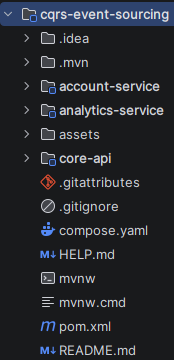

---

## Installation et Configuration

### Prérequis

Avant de démarrer le projet, assurez-vous d'avoir installé :

- **JDK 21** (OpenJDK ou Oracle JDK)
- **Maven 3.8+**
- **Docker Desktop** (pour Axon Server et PostgreSQL)
- **Postman** (pour les tests d'API)
- **Git** (pour le versioning)

### Configuration de l'Environnement

#### 1. Vérification de Java

```bash
java -version
```

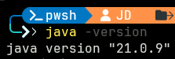

#### 2. Compilation du Projet

```bash
cd cqrs-event-sourcing
mvnw.cmd clean install
```

Cette commande compile tous les modules et exécute les tests unitaires.


#### 3. Configuration des Profils Spring

Le projet supporte deux profils :

- **dev** : Base de données H2 en mémoire, logs détaillés
- **prod** : PostgreSQL via Docker, logs optimisés

Pour le développement, le profil `dev` est activé par défaut dans [application.properties](account-service/src/main/resources/application.properties) :

```properties
spring.application.name=account-service
server.port=8081
spring.profiles.active=dev
```

---

## Démarrage de l'Application

### Étape 1 : Démarrer l'Infrastructure Docker

Le fichier [compose.yaml](compose.yaml) contient la définition de l'infrastructure :

```bash
docker-compose up -d
```

Cette commande démarre :
- **Axon Server** (ports 8024 et 8124)
- **PostgreSQL** (port 5432)

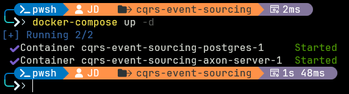

#### Vérification des Conteneurs

```bash
docker ps
```

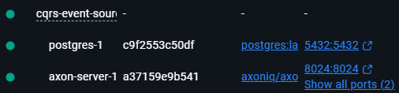

#### Accès à Axon Server Dashboard

Ouvrir un navigateur et accéder à : http://localhost:8024

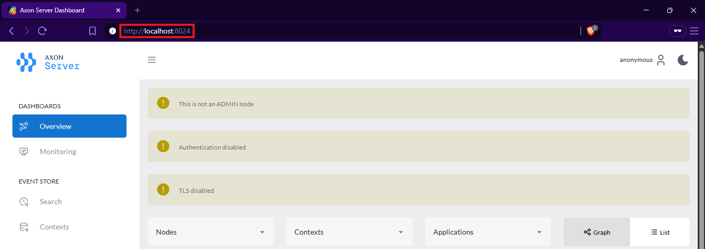

### Étape 2 : Démarrer Account Service

Dans un premier terminal :

```bash
mvnw.cmd spring-boot:run -pl account-service
```

Vérifier que le service démarre correctement sur le port 8081.

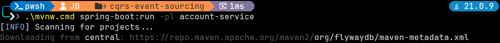
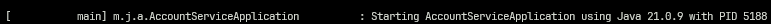


### Étape 3 : Démarrer Analytics Service

Dans un second terminal :

```bash
mvnw.cmd spring-boot:run -pl analytics-service
```

Vérifier que le service démarre correctement sur le port 8082.


### Étape 4 : Vérification des Services

#### Health Check des Services

```bash
curl http://localhost:8081/actuator/health
curl http://localhost:8082/actuator/health
```

Les deux services doivent répondre avec un statut `UP`.

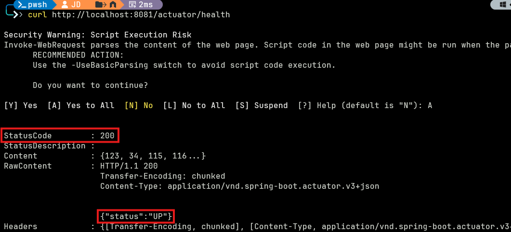
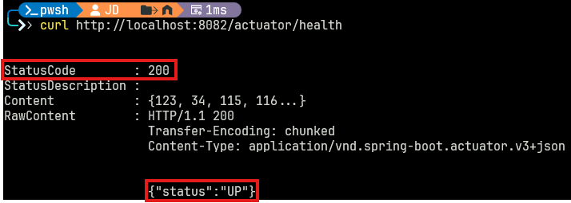

#### Accès aux Consoles H2

Pour consulter les bases de données en mémoire :

- **Account Service** : http://localhost:8081/h2-console
  - JDBC URL : `jdbc:h2:mem:accountdb`
  - Username : `sa`
  - Password : (vide)

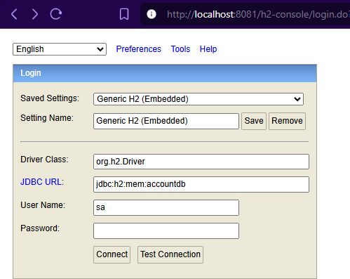
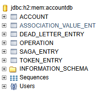

- **Analytics Service** : http://localhost:8082/h2-console
  - JDBC URL : `jdbc:h2:mem:analyticsdb`
  - Username : `sa`
  - Password : (vide)

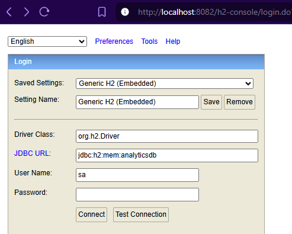
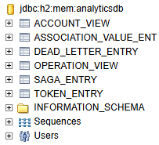

#### Accès à la Documentation Swagger

- **Account Service** : http://localhost:8081/swagger-ui.html

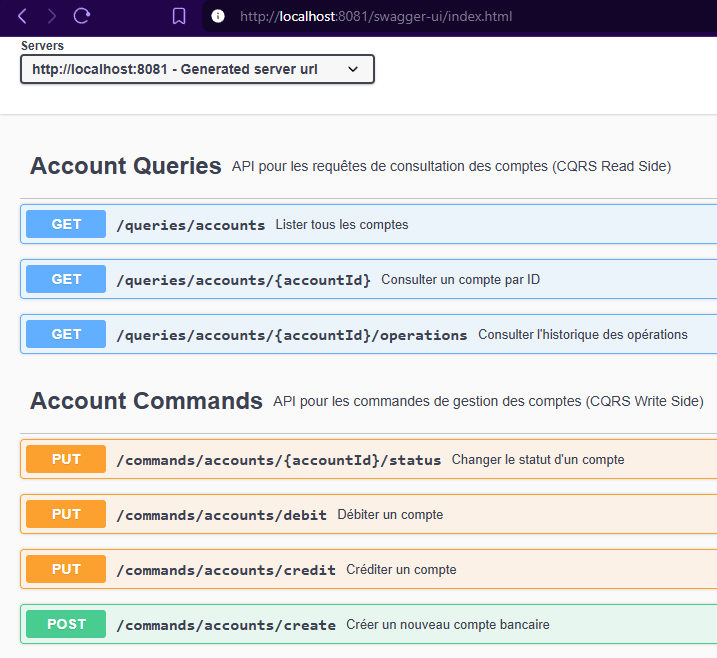
- **Analytics Service** : http://localhost:8082/swagger-ui.html

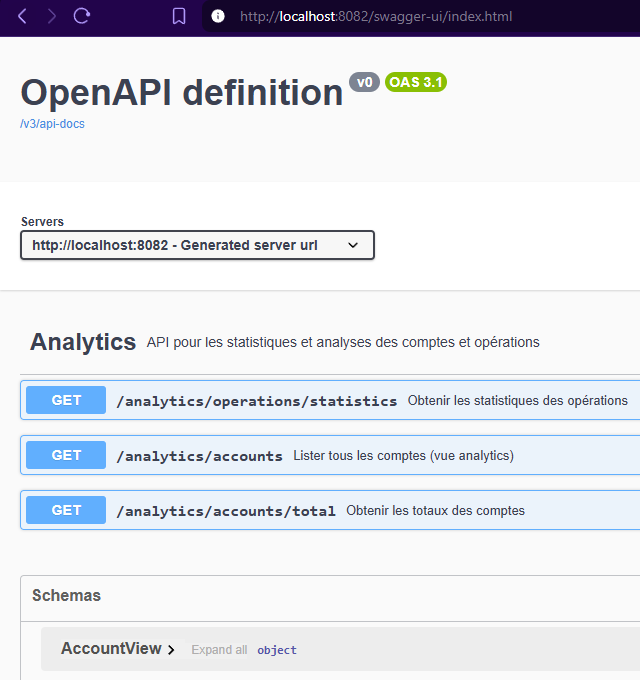

---

## Tests et Validation

### Configuration de Postman

#### 1. Créer un Environnement

Dans Postman, créer un environnement "CQRS Event Sourcing" avec les variables :

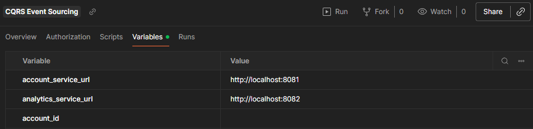

#### 2. Script de Capture Automatique de l'ID

Pour capturer automatiquement l'ID du compte créé, nous allons utiliser ce script dans l'onglet **Tests** de la requête "Create Account" :

```javascript
if (pm.response.code === 200) {
    var accountId = pm.response.text().replace(/"/g, '');
    pm.environment.set("account_id", accountId);
    console.log("Account ID saved: " + accountId);
}
```

### Scénario de Test Complet : Workflow Nominal

#### Test 1 : Créer un Compte

**Endpoint** : `POST {{account_service_url}}/commands/accounts/create`

**Body** :
```json
{
  "initialBalance": 5000,
  "currency": "MAD"
}
```

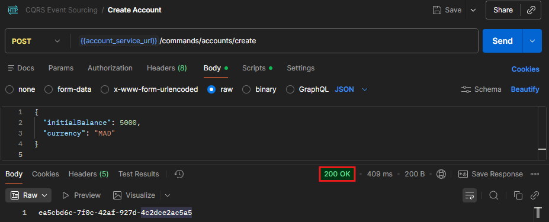

#### Vérification dans Axon Server

Après la création du compte, aller dans le dashboard Axon Server (http://localhost:8024) et consulter :
- **Search** → Chercher l'aggregate ID retourné
- Visualiser l'événement `AccountCreatedEvent` dans l'Event Store

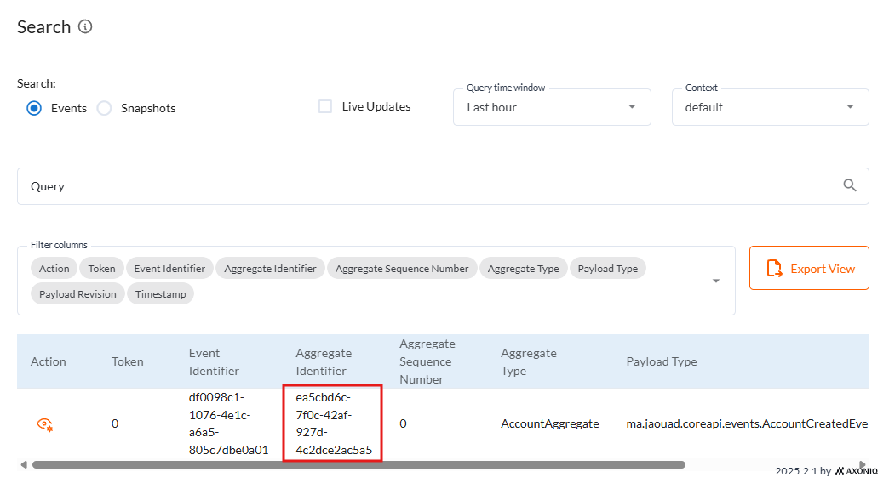

#### Test 2 : Activer le Compte

**Endpoint** : `PUT {{account_service_url}}/commands/accounts/{{account_id}}/status?status=ACTIVATED`

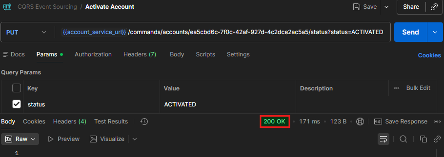

#### Test 3 : Créditer le Compte

**Endpoint** : `PUT {{account_service_url}}/commands/accounts/credit`

**Body** :
```json
{
  "accountId": "{{account_id}}",
  "amount": 2000,
  "currency": "MAD"
}
```


#### Test 4 : Débiter le Compte

**Endpoint** : `PUT {{account_service_url}}/commands/accounts/debit`

**Body** :
```json
{
  "accountId": "{{account_id}}",
  "amount": 1500,
  "currency": "MAD"
}
```

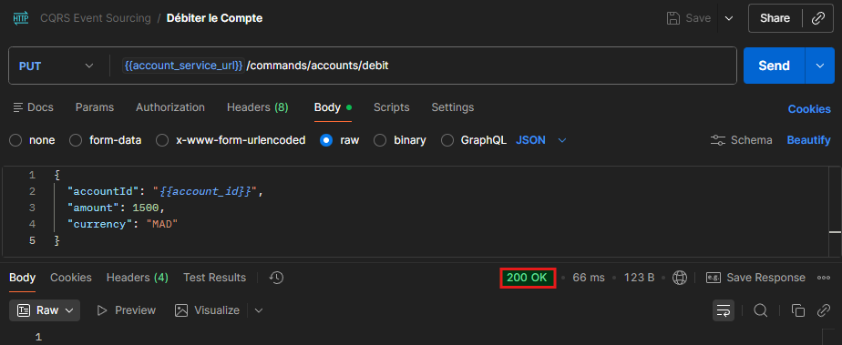

#### Test 5 : Consulter le Compte

**Endpoint** : `GET {{account_service_url}}/queries/accounts/{{account_id}}`

```json
{
  "id": "...",
  "balance": 5500.0,
  "status": "ACTIVATED",
  "currency": "MAD"
}
```

Balance finale = 5000 (initial) + 2000 (crédit) - 1500 (débit) = **5500 MAD**

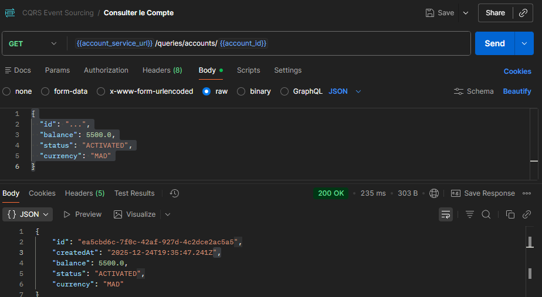

#### Test 6 : Consulter l'Historique des Opérations

**Endpoint** : `GET {{account_service_url}}/queries/accounts/{{account_id}}/operations`

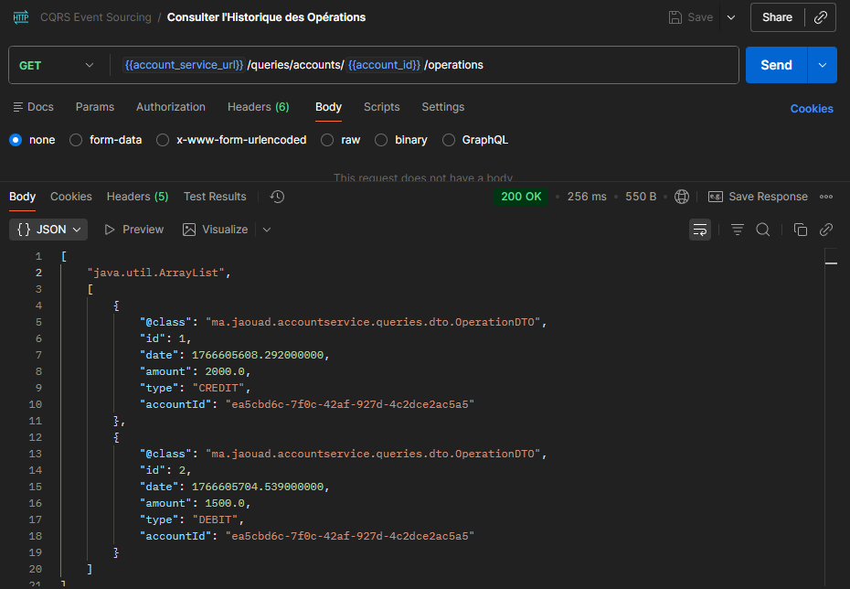

#### Test 7 : Consulter Tous les Comptes

**Endpoint** : `GET {{account_service_url}}/queries/accounts`

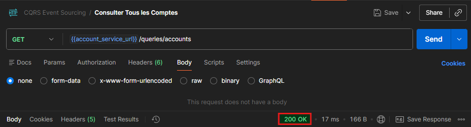

### Tests d'Analyse (Analytics Service)

#### Test 8 : Statistiques des Opérations

**Endpoint** : `GET {{analytics_service_url}}/analytics/operations/statistics`

```json
{
  "totalCredits": 1,
  "totalDebits": 1,
  "amountCredits": 2000.0,
  "amountDebits": 1500.0
}
```

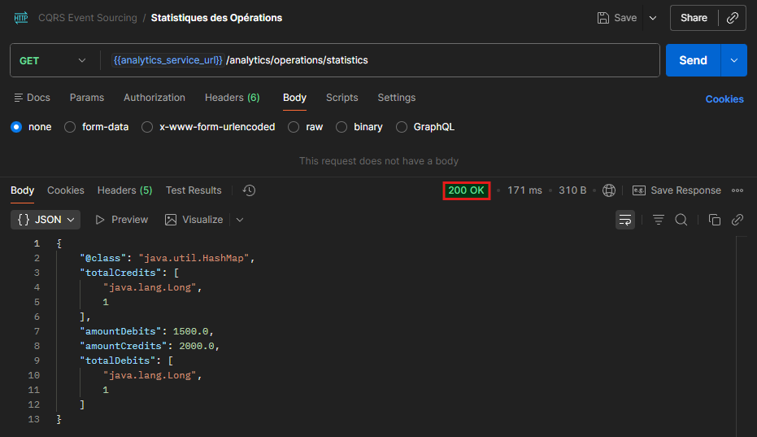

#### Test 9 : Total des Comptes

**Endpoint** : `GET {{analytics_service_url}}/analytics/accounts/total`

```json
{
  "totalAccounts": 1,
  "totalBalance": 5500.0
}
```

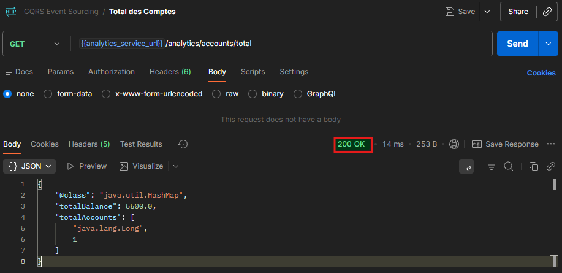

### Tests de Validation et Gestion d'Erreurs

#### Test 10 : Création avec Balance Négative

**Endpoint** : `POST {{account_service_url}}/commands/accounts/create`

**Body** :
```json
{
  "initialBalance": -1000,
  "currency": "MAD"
}
```

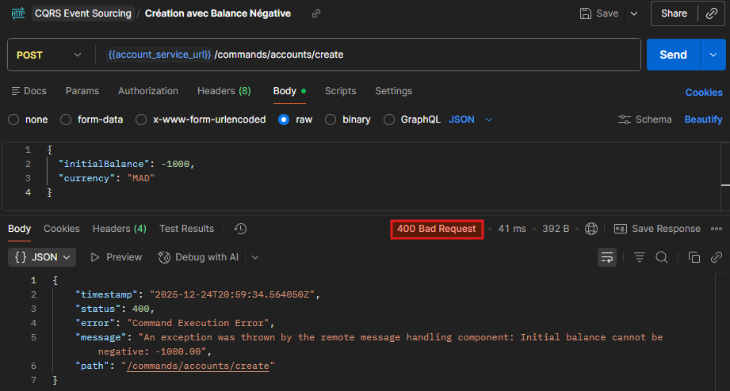

#### Test 11 : Crédit sur Compte Non Activé

Créer un nouveau compte sans l'activer, puis tenter de le créditer.

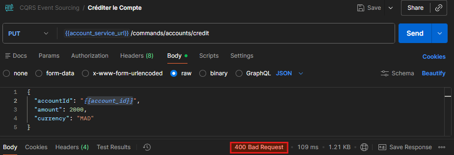

#### Test 12 : Débit avec Solde Insuffisant

**Endpoint** : `PUT {{account_service_url}}/commands/accounts/debit`

**Body** :
```json
{
  "accountId": "{{account_id}}",
  "amount": 999999,
  "currency": "MAD"
}
```

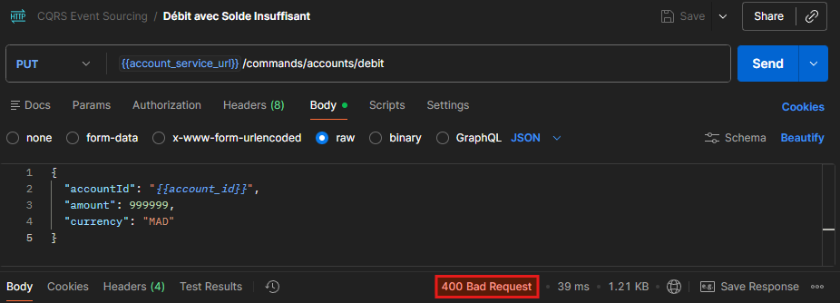

#### Test 13 : Consultation de Compte Inexistant

**Endpoint** : `GET {{account_service_url}}/queries/accounts/inexistant-id-12345`

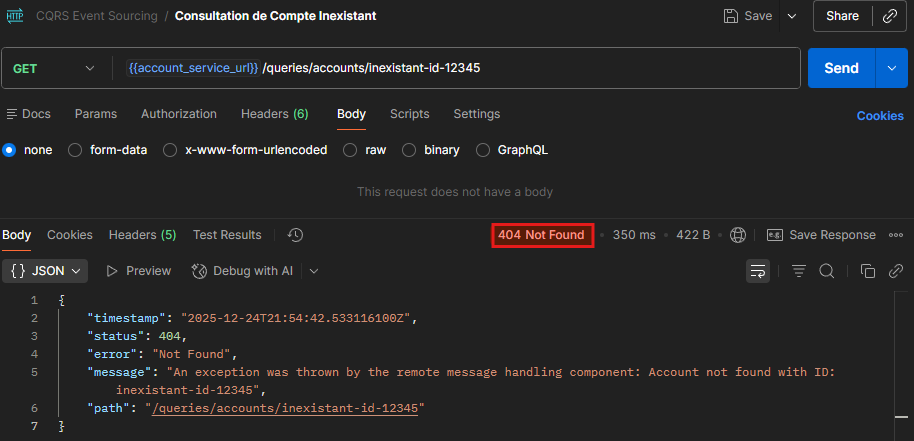

---

## Résultats et Observations

### Points Forts de l'Architecture

1. **Séparation des Responsabilités**
   - Le Command Side gère exclusivement les modifications d'état
   - Le Query Side est optimisé pour les lectures avec des projections dénormalisées
   - Chaque service a sa propre base de données (pattern Database per Service)

2. **Traçabilité Complète**
   - Tous les événements sont stockés de manière immuable dans Axon Server
   - Possibilité de reconstruire l'état du système à tout moment (replay)
   - Audit naturel de toutes les opérations bancaires

3. **Scalabilité**
   - Les services Command et Query peuvent être scalés indépendamment
   - Le bus d'événements (Axon Server) permet l'ajout facile de nouveaux services consommateurs
   - Analytics Service démontre comment un nouveau service peut être ajouté sans modifier l'existant

4. **Cohérence Éventuelle**
   - Les événements sont propagés de manière asynchrone
   - Chaque service maintient sa propre projection cohérente
   - Délai de propagation négligeable en environnement local

### Observations sur les Tests

- **Temps de réponse moyen** : < 500ms pour les commandes
- **Propagation des événements** : Quasi-instantanée (< 100ms)
- **Gestion des erreurs** : Validation robuste au niveau de l'Aggregate
- **Idempotence** : Les Event Handlers peuvent traiter les événements plusieurs fois sans effet de bord

### Limitations Identifiées

1. **Complexité** : L'architecture CQRS/Event Sourcing ajoute de la complexité par rapport à un CRUD classique
2. **Cohérence éventuelle** : Nécessite de gérer les cas où les projections ne sont pas encore à jour
3. **Gestion des événements** : Évolution du schéma des événements nécessite un versioning approprié
4. **Débug** : Plus difficile de tracer les flux asynchrones

---

## Conclusion

Ce projet démontre avec succès l'implémentation d'une architecture micro-services moderne basée sur CQRS et Event Sourcing. L'utilisation d'Axon Framework simplifie considérablement la mise en oeuvre de ces patterns complexes en fournissant :

- Un Event Store performant et distribué
- Un système de routing des messages fiable
- Des abstractions claires pour les Aggregates, Commands et Events
- Une intégration transparente avec Spring Boot

Les tests réalisés valident le bon fonctionnement de l'architecture :
- Séparation effective des responsabilités Command/Query
- Propagation correcte des événements entre les services
- Gestion robuste des erreurs et validations métier
- Cohérence éventuelle maintenue entre les différentes projections

Cette architecture est particulièrement adaptée aux systèmes où :
- L'audit et la traçabilité sont critiques (systèmes bancaires, e-commerce)
- La scalabilité horizontale est nécessaire
- Les exigences de lecture et d'écriture sont très différentes
- L'ajout de nouveaux consommateurs d'événements est fréquent

### Perspectives d'Amélioration

1. **Sécurité** : Ajouter Spring Security avec JWT pour l'authentification
2. **Monitoring** : Intégrer Prometheus et Grafana pour la supervision
3. **Sagas** : Implémenter des transactions distribuées pour les workflows complexes
4. **Snapshots** : Optimiser la reconstruction des Aggregates avec des snapshots
5. **API Gateway** : Ajouter un point d'entrée unique avec Spring Cloud Gateway
6. **Containerisation** : Créer des images Docker pour les micro-services

### Ressources et Documentation

- **Axon Framework** : https://docs.axoniq.io/
- **CQRS Pattern** : https://martinfowler.com/bliki/CQRS.html
- **Event Sourcing** : https://martinfowler.com/eaaDev/EventSourcing.html
- **Spring Boot** : https://spring.io/projects/spring-boot

---

## Salah-Eddine JAOUAD